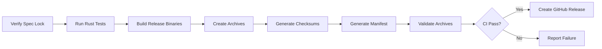

# Onus Release Pipeline

**Version:** 0.1.0
**Date:** 2026-06-19

---

## Pipeline Steps



### 1. Verify Specification Lock

```bash
python tools/spec_lock/verify_spec_lock.py
```

Fails if locked documents have been modified without approval.

### 2. Run Rust Tests

```bash
cd onus
cargo test --lib
cargo test --tests
cargo build --all-targets
cargo clippy --all-targets --all-features
```

### 3. Run Python Tests

```bash
cd bindings/python
python -m pytest -q
```

### 4. Run Frontend Tests

```bash
cd apps/onus-console
npm ci && npm run lint && npm test && npm run build

cd apps/onus-site
npm ci && npm run lint && npm test && npm run build
```

### 5. Build Release Binaries

```bash
./scripts/release/build-release.ps1   # Windows
./scripts/release/build-release.sh    # Linux
```

### 6. Create Archives

Archive contents:
- `bin/onus` (or `bin/onus.exe`) — release binary
- `LICENSE` — Apache 2.0 / MIT license
- `README.md` — quick-start instructions
- `install-onus.ps1` or `install-onus.sh` — platform installer
- `uninstall-onus.ps1` or `uninstall-onus.sh` — platform uninstaller

### 7. Generate Checksums

SHA-256 checksums are written to `dist/releases/SHA256SUMS`.

### 8. Generate Release Manifest

Structured JSON written to `dist/releases/release-manifest.json`.

### 9. Validate Archives

```bash
./scripts/release/verify-release.ps1   # Windows
./scripts/release/verify-release.sh    # Linux
```

---

## External Requirements

| Requirement | Purpose | Status |
|---|---|---|
| **GitHub repository** | Release hosting, artifact storage | Available: github.com/ahsanmoizz/onus |
| **GitHub Actions** | CI pipeline | Available (beta) |
| **GitHub OAuth token** | Create releases via `gh` CLI | Required |
| **Code signing certificate** | Windows Authenticode signing | NOT AVAILABLE |
| **macOS developer ID** | macOS binary signing | NOT AVAILABLE |
| **Domain** | Download URLs, website | Available (onus.ai) |
| **TLS certificate** | HTTPS for all downloads | Available (Let's Encrypt / Cloudflare) |
| **CI secrets** | GITHUB_TOKEN for release creation | Configured |

---

## Release Process

### Creating a new release:

```bash
# 1. Ensure clean tree
git checkout main
git pull

# 2. Verify spec lock
python tools/spec_lock/verify_spec_lock.py

# 3. Build on each platform (or use cross-compilation)
./scripts/release/build-release.ps1    # Windows: PowerShell
./scripts/release/build-release.sh     # Linux: Bash

# 4. Verify artifacts
./scripts/release/verify-release.ps1   # Windows
./scripts/release/verify-release.sh    # Linux

# 5. Create GitHub release
gh release create v0.1.0               \
  ./dist/releases/onus-0.1.0-windows-x86_64.zip   \
  ./dist/releases/onus-0.1.0-linux-x86_64.tar.gz  \
  ./dist/releases/onus-0.1.0-source.tar.gz         \
  ./dist/releases/SHA256SUMS                        \
  ./dist/releases/release-manifest.json             \
  --title "Onus v0.1.0"                             \
  --notes "See changelog for details"

# 6. Verify published release
./scripts/release/verify-release.ps1
```

### Dry-run:

```powershell
./scripts/release/build-release.ps1 --dry-run
```

---

## Secret Scanning

Before any release:

```bash
# Check for secrets in the release tree
grep -r "api_key\|API_KEY\|secret\|password\|token" \
  --include="*.rs" --include="*.toml" --include="*.json" \
  --exclude-dir=target --exclude-dir=node_modules
```

Verify no `.env` files or local databases are packaged:

```bash
tar -tzf dist/releases/onus-*.tar.gz | grep -E '\.env$|\.db$|\.sqlite$|credentials'
```

---

## Roadmap

- [ ] Cross-compilation from single CI runner (Linux → Windows)
- [ ] macOS ARM64 build target
- [ ] Code signing for Windows binaries
- [ ] Homebrew formula for macOS
- [ ] choco/scoop package for Windows
- [ ] Linux .deb/.rpm packages
